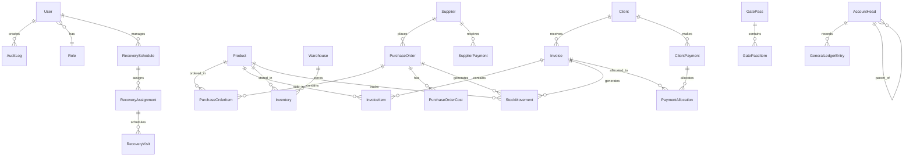

# Hisham Traders ERP - Database Schema

**Version:** 1.0
**Last Updated:** 2025-01-15
**Author:** Winston (Architect)
**Database:** MySQL 8+

---

## Change Log

| Date | Version | Description | Author |
|------|---------|-------------|--------|
| 2025-11-24 | 1.1 | Added ProductVariant model and variant support to Product model | Winston (Architect) |
| 2025-01-15 | 1.0 | Initial database schema for MVP (Epics 1-4) + Phase 2 (Epics 5-8) | Winston (Architect) |

---

## Table of Contents

1. [Overview](#overview)
2. [Complete Prisma Schema](#complete-prisma-schema)
3. [Entity Relationship Diagram](#entity-relationship-diagram)
4. [Table Descriptions](#table-descriptions)
5. [Indexing Strategy](#indexing-strategy)
6. [Migration Strategy](#migration-strategy)

---

## Overview

This document defines the complete database schema for the Hisham Traders ERP system using Prisma ORM with MySQL 8+.

**Key Design Principles:**
- **Multi-tenant ready** (tenantId fields included for future Phase 3)
- **Audit trail** for all critical operations
- **Soft deletes** (status flags instead of hard deletes)
- **ACID compliance** for inventory and financial transactions
- **Optimized indexing** for common queries
- **Foreign key constraints** for data integrity

**Database Conventions:**
- **Primary Keys:** UUIDs (cuid) for globally unique identifiers
- **Timestamps:** createdAt, updatedAt on all tables
- **Soft Deletes:** status field or deletedAt timestamp
- **Naming:** camelCase for fields, PascalCase for models
- **Enums:** SCREAMING_SNAKE_CASE

---

## Architecture Decisions

### Product Variant Architecture (Story 2.4.1)

**Decision:** Implement product variants as a separate `ProductVariant` table with JSON-based attributes.

**Rationale:**
1. **Flexibility:** Different product types have different attributes (color/size for some products, length/finish for others)
2. **Scalability:** Avoid creating multiple fixed columns for every possible attribute
3. **Maintainability:** Easy to add new attribute types without schema changes
4. **Performance:** JSON fields in MySQL 8+ support indexing and efficient queries

**Implementation:**
- `Product.hasVariants` flag indicates if a product has variants
- When `hasVariants=true`, variants are stored in `ProductVariant` table
- Each variant has its own SKU, pricing, and inventory tracking
- Attributes stored as JSON: `{"color": "Red", "size": "Medium"}` or `{"length": "250mm", "finish": "Chrome"}`
- POItem can reference either Product (for non-variant products) or ProductVariant (for specific variants)

**Business Rules:**
- If `hasVariants=false`, use base Product pricing and SKU
- If `hasVariants=true`, must select a specific variant when creating PO/Invoice
- Variants inherit category and brand from parent Product
- Each variant has independent pricing, reorder levels, and bin locations
- Variant SKU format: `{BASE_SKU}-{VARIANT_CODE}` (e.g., `PROD-2025-001-RED-M`)

**Example Use Cases:**
- Faucets: Same model with different finishes (Chrome, Brushed Nickel, Oil-Rubbed Bronze)
- Sinks: Same design with different sizes (24", 30", 36")
- Shower heads: Combinations of finish and spray pattern
- Toilets: Elongated vs Round bowl, different colors

---

## Complete Prisma Schema

```prisma
// prisma/schema.prisma
datasource db {
  provider = "mysql"
  url      = env("DATABASE_URL")
}

generator client {
  provider = "prisma-client-js"
}

// ============================================================================
// EPIC 1: Foundation, Authentication & Audit
// ============================================================================

model User {
  id           String    @id @default(cuid())
  email        String    @unique
  name         String
  passwordHash String
  roleId       String
  status       UserStatus @default(ACTIVE)
  lastLoginAt  DateTime?
  createdAt    DateTime  @default(now())
  updatedAt    DateTime  @updatedAt
  deletedAt    DateTime?

  role         Role      @relation(fields: [roleId], references: [id])
  auditLogs    AuditLog[]

  @@index([email])
  @@index([roleId])
  @@index([status])
  @@map("users")
}

enum UserStatus {
  ACTIVE
  INACTIVE
  SUSPENDED
}

model Role {
  id          String   @id @default(cuid())
  name        String   @unique
  description String?
  permissions Json?    // Flexible permissions structure
  createdAt   DateTime @default(now())
  updatedAt   DateTime @updatedAt

  users       User[]

  @@map("roles")
}

model AuditLog {
  id            String   @id @default(cuid())
  userId        String
  action        String   // CREATE, UPDATE, DELETE, VIEW, LOGIN, LOGOUT
  entityType    String   // Product, Invoice, Payment, etc.
  entityId      String?
  timestamp     DateTime @default(now())
  ipAddress     String?
  userAgent     String?
  changedFields Json?    // { field: { old: value, new: value } }
  notes         String?

  user          User     @relation(fields: [userId], references: [id])

  @@index([userId])
  @@index([timestamp])
  @@index([entityType, entityId])
  @@index([action])
  @@map("audit_logs")
}

// ============================================================================
// EPIC 2: Import & Inventory Management
// ============================================================================

model Supplier {
  id           String         @id @default(cuid())
  name         String
  country      String?
  contactPerson String?
  email        String?
  phone        String?
  address      String?
  paymentTerms String?        // "30 days net", "50% advance"
  status       SupplierStatus @default(ACTIVE)
  createdAt    DateTime       @default(now())
  updatedAt    DateTime       @updatedAt
  deletedAt    DateTime?

  purchaseOrders PurchaseOrder[]
  payments       SupplierPayment[]

  @@index([status])
  @@index([name])
  @@map("suppliers")
}

enum SupplierStatus {
  ACTIVE
  INACTIVE
}

model PurchaseOrder {
  id                 String              @id @default(cuid())
  supplierId         String
  poNumber           String              @unique
  orderDate          DateTime
  expectedArrivalDate DateTime?
  status             PurchaseOrderStatus @default(PENDING)
  totalAmount        Decimal             @db.Decimal(12, 2)
  notes              String?

  // Import documentation
  containerNo        String?
  shipDate           DateTime?
  arrivalDate        DateTime?

  createdAt          DateTime            @default(now())
  updatedAt          DateTime            @updatedAt

  supplier           Supplier            @relation(fields: [supplierId], references: [id])
  items              PurchaseOrderItem[]
  costs              PurchaseOrderCost[]
  stockMovements     StockMovement[]

  @@index([supplierId])
  @@index([status])
  @@index([orderDate])
  @@map("purchase_orders")
}

enum PurchaseOrderStatus {
  PENDING
  IN_TRANSIT
  RECEIVED
  CANCELLED
}

model PurchaseOrderItem {
  id              String          @id @default(cuid())
  poId            String
  productId       String
  productVariantId String?
  quantity        Int
  unitCost        Decimal         @db.Decimal(10, 2)
  totalCost       Decimal         @db.Decimal(12, 2)

  purchaseOrder   PurchaseOrder   @relation(fields: [poId], references: [id], onDelete: Cascade)
  product         Product         @relation(fields: [productId], references: [id])
  productVariant  ProductVariant? @relation(fields: [productVariantId], references: [id])

  @@index([poId])
  @@index([productId])
  @@index([productVariantId])
  @@map("purchase_order_items")
}

model PurchaseOrderCost {
  id          String   @id @default(cuid())
  poId        String
  type        String   // shipping, customs, tax, other
  amount      Decimal  @db.Decimal(10, 2)
  description String?
  createdAt   DateTime @default(now())

  purchaseOrder PurchaseOrder @relation(fields: [poId], references: [id], onDelete: Cascade)

  @@index([poId])
  @@map("purchase_order_costs")
}

model Product {
  id           String        @id @default(cuid())
  sku          String        @unique
  name         String
  brand        String?
  category     String?
  hasVariants  Boolean       @default(false)
  costPrice    Decimal?      @db.Decimal(10, 2)
  sellingPrice Decimal       @db.Decimal(10, 2)
  reorderLevel Int           @default(0)
  binLocation  String?
  status       ProductStatus @default(ACTIVE)
  createdAt    DateTime      @default(now())
  updatedAt    DateTime      @updatedAt
  deletedAt    DateTime?

  variants     ProductVariant[]
  poItems      PurchaseOrderItem[]
  invoiceItems InvoiceItem[]
  inventory    Inventory[]
  stockMovements StockMovement[]

  @@index([sku])
  @@index([status])
  @@index([category])
  @@index([name])
  @@index([hasVariants])
  @@map("products")
}

enum ProductStatus {
  ACTIVE
  INACTIVE
}

model ProductVariant {
  id            String         @id @default(cuid())
  productId     String
  sku           String         @unique
  variantName   String
  attributes    Json
  costPrice     Decimal        @db.Decimal(10, 2)
  sellingPrice  Decimal        @db.Decimal(10, 2)
  reorderLevel  Int            @default(10)
  binLocation   String?
  status        VariantStatus  @default(ACTIVE)
  createdAt     DateTime       @default(now())
  updatedAt     DateTime       @updatedAt

  product       Product        @relation(fields: [productId], references: [id], onDelete: Cascade)
  poItems       PurchaseOrderItem[]

  @@index([productId])
  @@index([sku])
  @@index([status])
  @@map("product_variants")
}

enum VariantStatus {
  ACTIVE
  INACTIVE
}

model Warehouse {
  id        String          @id @default(cuid())
  name      String
  location  String?
  city      String?
  status    WarehouseStatus @default(ACTIVE)
  createdAt DateTime        @default(now())
  updatedAt DateTime        @updatedAt
  deletedAt DateTime?

  inventory Inventory[]

  @@index([status])
  @@map("warehouses")
}

enum WarehouseStatus {
  ACTIVE
  INACTIVE
}

model Inventory {
  id          String   @id @default(cuid())
  productId   String
  warehouseId String
  quantity    Int      @default(0)
  batchNo     String?
  binLocation String?
  createdAt   DateTime @default(now())
  updatedAt   DateTime @updatedAt

  product     Product   @relation(fields: [productId], references: [id])
  warehouse   Warehouse @relation(fields: [warehouseId], references: [id])

  @@unique([productId, warehouseId, batchNo])
  @@index([productId])
  @@index([warehouseId])
  @@index([quantity])
  @@map("inventory")
}

model StockMovement {
  id            String              @id @default(cuid())
  productId     String
  warehouseId   String?
  type          StockMovementType
  quantity      Int                 // Positive for IN, Negative for OUT
  referenceType String?             // PO, INVOICE, ADJUSTMENT, TRANSFER
  referenceId   String?
  notes         String?
  createdAt     DateTime            @default(now())

  product       Product             @relation(fields: [productId], references: [id])
  purchaseOrder PurchaseOrder?      @relation(fields: [referenceId], references: [id])
  invoice       Invoice?            @relation(fields: [referenceId], references: [id])

  @@index([productId])
  @@index([warehouseId])
  @@index([type])
  @@index([createdAt])
  @@map("stock_movements")
}

enum StockMovementType {
  RECEIPT       // Stock received from PO
  SALE          // Stock sold via invoice
  ADJUSTMENT    // Manual adjustment
  TRANSFER      // Warehouse transfer
  RETURN        // Return/reversal
}

// ============================================================================
// EPIC 3: Sales & Payments
// ============================================================================

model Client {
  id               String       @id @default(cuid())
  name             String
  contactPerson    String?
  phone            String?
  email            String?
  city             String?
  area             String?
  creditLimit      Decimal      @default(0) @db.Decimal(12, 2)
  paymentTermsDays Int          @default(0)
  balance          Decimal      @default(0) @db.Decimal(12, 2)
  status           ClientStatus @default(ACTIVE)
  isTaxExempt      Boolean      @default(false)
  createdAt        DateTime     @default(now())
  updatedAt        DateTime     @updatedAt
  deletedAt        DateTime?

  invoices         Invoice[]
  payments         ClientPayment[]

  @@index([status])
  @@index([name])
  @@index([balance])
  @@map("clients")
}

enum ClientStatus {
  ACTIVE
  INACTIVE
  SUSPENDED
}

model Invoice {
  id            String        @id @default(cuid())
  invoiceNumber String        @unique
  clientId      String
  invoiceDate   DateTime
  dueDate       DateTime
  paymentType   PaymentType
  subtotal      Decimal       @db.Decimal(12, 2)
  taxAmount     Decimal       @default(0) @db.Decimal(12, 2)
  total         Decimal       @db.Decimal(12, 2)
  paidAmount    Decimal       @default(0) @db.Decimal(12, 2)
  status        InvoiceStatus @default(PENDING)
  notes         String?
  createdAt     DateTime      @default(now())
  updatedAt     DateTime      @updatedAt

  client        Client        @relation(fields: [clientId], references: [id])
  items         InvoiceItem[]
  stockMovements StockMovement[]
  paymentAllocations PaymentAllocation[]

  @@index([clientId])
  @@index([status])
  @@index([invoiceDate])
  @@index([dueDate])
  @@map("invoices")
}

enum PaymentType {
  CASH
  CREDIT
}

enum InvoiceStatus {
  PENDING
  PARTIAL
  PAID
  OVERDUE
  CANCELLED
}

model InvoiceItem {
  id         String  @id @default(cuid())
  invoiceId  String
  productId  String
  batchNo    String?
  quantity   Int
  unitPrice  Decimal @db.Decimal(10, 2)
  discount   Decimal @default(0) @db.Decimal(5, 2) // Percentage
  taxAmount  Decimal @default(0) @db.Decimal(10, 2)
  total      Decimal @db.Decimal(12, 2)

  invoice    Invoice @relation(fields: [invoiceId], references: [id], onDelete: Cascade)
  product    Product @relation(fields: [productId], references: [id])

  @@index([invoiceId])
  @@index([productId])
  @@map("invoice_items")
}

model ClientPayment {
  id              String    @id @default(cuid())
  clientId        String
  amount          Decimal   @db.Decimal(12, 2)
  method          PaymentMethod
  referenceNumber String?
  date            DateTime
  notes           String?
  createdAt       DateTime  @default(now())
  updatedAt       DateTime  @updatedAt

  client          Client    @relation(fields: [clientId], references: [id])
  allocations     PaymentAllocation[]

  @@index([clientId])
  @@index([date])
  @@index([method])
  @@map("client_payments")
}

enum PaymentMethod {
  CASH
  BANK_TRANSFER
  CHEQUE
  CARD
}

model PaymentAllocation {
  id        String   @id @default(cuid())
  paymentId String
  invoiceId String
  amount    Decimal  @db.Decimal(12, 2)
  createdAt DateTime @default(now())

  payment   ClientPayment @relation(fields: [paymentId], references: [id], onDelete: Cascade)
  invoice   Invoice       @relation(fields: [invoiceId], references: [id])

  @@index([paymentId])
  @@index([invoiceId])
  @@map("payment_allocations")
}

model SupplierPayment {
  id              String        @id @default(cuid())
  supplierId      String
  amount          Decimal       @db.Decimal(12, 2)
  method          PaymentMethod
  referenceNumber String?
  date            DateTime
  notes           String?
  createdAt       DateTime      @default(now())
  updatedAt       DateTime      @updatedAt

  supplier        Supplier      @relation(fields: [supplierId], references: [id])

  @@index([supplierId])
  @@index([date])
  @@map("supplier_payments")
}

model Expense {
  id              String         @id @default(cuid())
  date            DateTime
  category        ExpenseCategory
  amount          Decimal        @db.Decimal(12, 2)
  method          PaymentMethod
  referenceNumber String?
  description     String
  paidTo          String?
  notes           String?
  createdAt       DateTime       @default(now())
  updatedAt       DateTime       @updatedAt
  deletedAt       DateTime?

  @@index([date])
  @@index([category])
  @@map("expenses")
}

enum ExpenseCategory {
  RENT
  UTILITIES
  SALARIES
  TRANSPORT
  OFFICE_SUPPLIES
  MAINTENANCE
  MISCELLANEOUS
}

// ============================================================================
// EPIC 5: Account Heads & General Ledger (Phase 2)
// ============================================================================

model AccountHead {
  id          String           @id @default(cuid())
  code        String           @unique
  name        String
  type        AccountType
  parentId    String?
  description String?
  isSystem    Boolean          @default(false)
  status      AccountStatus    @default(ACTIVE)
  createdAt   DateTime         @default(now())
  updatedAt   DateTime         @updatedAt

  parent      AccountHead?     @relation("AccountHierarchy", fields: [parentId], references: [id])
  children    AccountHead[]    @relation("AccountHierarchy")
  glEntries   GeneralLedgerEntry[]

  @@index([type])
  @@index([status])
  @@map("account_heads")
}

enum AccountType {
  ASSET
  LIABILITY
  EQUITY
  REVENUE
  EXPENSE
}

enum AccountStatus {
  ACTIVE
  INACTIVE
}

model GeneralLedgerEntry {
  id            String      @id @default(cuid())
  transactionId String
  accountHeadId String
  date          DateTime
  debit         Decimal     @default(0) @db.Decimal(12, 2)
  credit        Decimal     @default(0) @db.Decimal(12, 2)
  description   String
  referenceType String?     // INVOICE, PAYMENT, EXPENSE, etc.
  referenceId   String?
  createdAt     DateTime    @default(now())

  accountHead   AccountHead @relation(fields: [accountHeadId], references: [id])

  @@index([transactionId])
  @@index([accountHeadId])
  @@index([date])
  @@map("general_ledger_entries")
}

// ============================================================================
// EPIC 6: Advanced Inventory (Phase 2)
// ============================================================================

model GatePass {
  id          String         @id @default(cuid())
  passNumber  String         @unique
  type        GatePassType
  clientId    String?
  date        DateTime
  vehicleNo   String?
  driverName  String?
  purpose     String
  status      GatePassStatus @default(PENDING)
  notes       String?
  createdAt   DateTime       @default(now())
  updatedAt   DateTime       @updatedAt

  items       GatePassItem[]

  @@index([status])
  @@index([date])
  @@map("gate_passes")
}

enum GatePassType {
  OUTWARD
  INWARD
  RETURNABLE
}

enum GatePassStatus {
  PENDING
  APPROVED
  RETURNED
  CANCELLED
}

model GatePassItem {
  id          String   @id @default(cuid())
  gatePassId  String
  productId   String
  quantity    Int
  returnedQty Int      @default(0)
  notes       String?

  gatePass    GatePass @relation(fields: [gatePassId], references: [id], onDelete: Cascade)

  @@index([gatePassId])
  @@map("gate_pass_items")
}

model BatchTracking {
  id           String    @id @default(cuid())
  productId    String
  batchNumber  String
  manufacturingDate DateTime?
  expiryDate   DateTime?
  quantity     Int
  status       BatchStatus @default(ACTIVE)
  createdAt    DateTime  @default(now())
  updatedAt    DateTime  @updatedAt

  @@unique([productId, batchNumber])
  @@index([expiryDate])
  @@map("batch_tracking")
}

enum BatchStatus {
  ACTIVE
  EXPIRED
  QUARANTINED
}

// ============================================================================
// EPIC 7: Recovery Management (Phase 2)
// ============================================================================

model RecoverySchedule {
  id          String              @id @default(cuid())
  agentId     String
  weekStarting DateTime
  status      RecoveryScheduleStatus @default(PENDING)
  notes       String?
  createdAt   DateTime            @default(now())
  updatedAt   DateTime            @updatedAt

  agent       User                @relation(fields: [agentId], references: [id])
  assignments RecoveryAssignment[]

  @@index([agentId])
  @@index([weekStarting])
  @@map("recovery_schedules")
}

enum RecoveryScheduleStatus {
  PENDING
  IN_PROGRESS
  COMPLETED
}

model RecoveryAssignment {
  id         String           @id @default(cuid())
  scheduleId String
  clientId   String
  dayOfWeek  Int              // 1 = Monday, 7 = Sunday
  visitOrder Int
  notes      String?

  schedule   RecoverySchedule @relation(fields: [scheduleId], references: [id], onDelete: Cascade)
  visits     RecoveryVisit[]

  @@index([scheduleId])
  @@map("recovery_assignments")
}

model RecoveryVisit {
  id           String        @id @default(cuid())
  assignmentId String
  date         DateTime
  status       VisitStatus
  amountCollected Decimal?   @db.Decimal(12, 2)
  notes        String?
  createdAt    DateTime      @default(now())

  assignment   RecoveryAssignment @relation(fields: [assignmentId], references: [id])

  @@index([assignmentId])
  @@index([date])
  @@map("recovery_visits")
}

enum VisitStatus {
  SCHEDULED
  VISITED
  PAYMENT_RECEIVED
  NOT_HOME
  REFUSED
  POSTPONED
}

// ============================================================================
// EPIC 8: System Configuration
// ============================================================================

model SystemConfig {
  id        String   @id @default(cuid())
  key       String   @unique
  value     String
  dataType  String   // string, number, boolean, json
  category  String?  // tax, general, features
  description String?
  updatedAt DateTime @updatedAt

  @@index([category])
  @@map("system_config")
}
```

---

## Entity Relationship Diagram



---

## Table Descriptions

### Core Authentication & Audit (Epic 1)

**User**
- Stores user account information
- Links to Role for permissions
- Tracks login history

**Role**
- Defines user roles (Admin, Warehouse Manager, Sales Officer, Accountant, Recovery Agent)
- Stores permissions in flexible JSON format

**AuditLog**
- Immutable audit trail for all system operations
- Tracks: who, what, when, where
- Captures before/after state changes

### Procurement & Inventory (Epic 2)

**Supplier**
- Supplier master data
- Payment terms tracking

**PurchaseOrder**
- Purchase orders with import documentation
- Tracks container numbers, shipping dates
- Status workflow: PENDING → IN_TRANSIT → RECEIVED

**PurchaseOrderItem**
- Line items for purchase orders
- Links products to POs

**PurchaseOrderCost**
- Additional costs (shipping, customs, taxes)
- Used for landed cost calculation

**Product**
- Product master data
- SKU, pricing, reorder levels
- Soft delete via status field
- Supports variants via hasVariants flag

**ProductVariant**
- Product variants with attribute-based variations (color, size, finish, length, etc.)
- Each variant has unique SKU and independent pricing
- Attributes stored as JSON for flexibility (e.g., {"color": "Red", "size": "Medium"})
- Linked to parent Product via productId
- Used in POItem when ordering specific variants

**Warehouse**
- Warehouse locations
- Multi-warehouse support

**Inventory**
- Real-time stock quantities by product/warehouse/batch
- Unique constraint prevents duplicate inventory records

**StockMovement**
- Immutable stock movement history
- Tracks all inventory changes (receipts, sales, adjustments, transfers)

### Sales & Payments (Epic 3)

**Client**
- Client master data with credit terms
- Credit limit and payment terms tracking
- Running balance calculation

**Invoice**
- Sales invoices with automatic inventory deduction
- FIFO batch deduction
- Credit limit enforcement

**InvoiceItem**
- Invoice line items with tax calculation
- Discount and tax per line

**ClientPayment**
- Payments received from clients
- Multiple payment methods

**PaymentAllocation**
- Links payments to specific invoices
- FIFO allocation logic

**SupplierPayment**
- Payments made to suppliers

**Expense**
- Operating expense tracking
- Categorized for reporting

### General Ledger (Epic 5 - Phase 2)

**AccountHead**
- Chart of accounts
- Hierarchical structure (parent-child)
- Five account types: Asset, Liability, Equity, Revenue, Expense

**GeneralLedgerEntry**
- Double-entry bookkeeping
- Every transaction has debit and credit entries
- Links to source transactions (invoices, payments, etc.)

### Advanced Inventory (Epic 6 - Phase 2)

**GatePass**
- Material gate passes for in/out movements
- Tracks vehicle and driver info

**GatePassItem**
- Line items for gate passes
- Return tracking for returnable items

**BatchTracking**
- Batch/lot tracking with expiry dates
- Manufacturing and expiry date management

### Recovery Management (Epic 7 - Phase 2)

**RecoverySchedule**
- Weekly recovery schedules for agents
- Assignment of clients to agents

**RecoveryAssignment**
- Client assignments within schedules
- Day-of-week and visit order

**RecoveryVisit**
- Visit logs with outcomes
- Payment collection tracking

### System Configuration (Epic 8)

**SystemConfig**
- System-wide configuration (tax rates, features, etc.)
- Key-value store with typed values

---

## Indexing Strategy

### Performance-Critical Indexes

**User Authentication:**
- `users.email` - Login lookups
- `users.roleId` - Permission checks
- `users.status` - Active user filtering

**Audit Queries:**
- `audit_logs.userId` - User activity reports
- `audit_logs.timestamp` - Time-based queries
- `audit_logs.(entityType, entityId)` - Entity history

**Inventory Lookups:**
- `products.sku` - Fast SKU searches
- `products.status` - Active product filtering
- `inventory.productId` - Stock by product
- `inventory.warehouseId` - Stock by warehouse
- `inventory.quantity` - Low stock alerts

**Sales Queries:**
- `invoices.clientId` - Client invoice history
- `invoices.status` - Outstanding invoices
- `invoices.invoiceDate` - Date range queries
- `invoices.dueDate` - Overdue detection

**Payment Tracking:**
- `client_payments.clientId` - Payment history
- `client_payments.date` - Date range reports

**Stock Movements:**
- `stock_movements.productId` - Product movement history
- `stock_movements.createdAt` - Recent movements

### Unique Constraints

- `users.email` - One account per email
- `products.sku` - Unique product identifier
- `purchase_orders.poNumber` - Unique PO numbers
- `invoices.invoiceNumber` - Unique invoice numbers
- `inventory.(productId, warehouseId, batchNo)` - Prevent duplicate inventory records

---

## Migration Strategy

### Initial Setup

```bash
# 1. Initialize Prisma
npx prisma init

# 2. Create initial migration
npx prisma migrate dev --name init

# 3. Generate Prisma Client
npx prisma generate

# 4. Seed database with roles and admin user
npx prisma db seed
```

### Seed Data (prisma/seed.ts)

```typescript
import { PrismaClient } from '@prisma/client';
import bcrypt from 'bcrypt';

const prisma = new PrismaClient();

async function main() {
  // Create roles
  const roles = await Promise.all([
    prisma.role.create({
      data: {
        name: 'ADMIN',
        description: 'Full system access',
      },
    }),
    prisma.role.create({
      data: {
        name: 'WAREHOUSE_MANAGER',
        description: 'Manage inventory and stock',
      },
    }),
    prisma.role.create({
      data: {
        name: 'SALES_OFFICER',
        description: 'Create invoices and manage clients',
      },
    }),
    prisma.role.create({
      data: {
        name: 'ACCOUNTANT',
        description: 'Manage finances and payments',
      },
    }),
    prisma.role.create({
      data: {
        name: 'RECOVERY_AGENT',
        description: 'Collect payments from clients',
      },
    }),
  ]);

  // Create default admin user
  const passwordHash = await bcrypt.hash('admin123', 10);
  await prisma.user.create({
    data: {
      email: 'admin@hishamtraders.com',
      name: 'System Administrator',
      passwordHash,
      roleId: roles[0].id,
      status: 'ACTIVE',
    },
  });

  // Create system configuration defaults
  await prisma.systemConfig.createMany({
    data: [
      {
        key: 'DEFAULT_SALES_TAX_RATE',
        value: '0.17',
        dataType: 'number',
        category: 'tax',
        description: 'Default sales tax rate (17% GST)',
      },
      {
        key: 'AUDIT_LOG_RETENTION_DAYS',
        value: '730',
        dataType: 'number',
        category: 'general',
        description: 'Audit log retention period (2 years)',
      },
    ],
  });

  console.log('✅ Database seeded successfully');
}

main()
  .catch((e) => {
    console.error('❌ Seed failed:', e);
    process.exit(1);
  })
  .finally(async () => {
    await prisma.$disconnect();
  });
```

### Future Migrations

```bash
# Create a new migration
npx prisma migrate dev --name add_feature_name

# Apply migrations to production
npx prisma migrate deploy

# Reset database (DEV ONLY)
npx prisma migrate reset
```

### Migration Best Practices

1. **Never edit existing migrations** - Create new migrations for changes
2. **Test migrations** on staging before production
3. **Backup database** before running migrations in production
4. **Use transactions** for complex migrations
5. **Document breaking changes** in migration files

---

## Database Maintenance

### Regular Tasks

**Daily:**
- Monitor database connections
- Check slow query log
- Verify backup completion

**Weekly:**
- Analyze query performance
- Review index usage
- Check database size growth

**Monthly:**
- Optimize tables (MySQL)
- Review and optimize indexes
- Archive old audit logs (if needed)

### Backup Strategy

```bash
# Automated daily backup
mysqldump -h localhost -u root -p hisham_erp > backup_$(date +%Y%m%d).sql

# Backup with compression
mysqldump -h localhost -u root -p hisham_erp | gzip > backup_$(date +%Y%m%d).sql.gz

# Restore from backup
mysql -h localhost -u root -p hisham_erp < backup_20250115.sql
```

**Retention Policy:**
- Daily backups: Keep for 7 days
- Weekly backups: Keep for 4 weeks
- Monthly backups: Keep for 12 months

---

**Document Version:** 1.0
**Last Updated:** 2025-01-15
**Status:** Approved for Development
