# Information Architecture

**Part of:** [Design System](./design-system.md)
**Version:** 1.0
**Last Updated:** January 15, 2025

---

## Site Map / Screen Inventory

```mermaid
graph TD
    Login[Login Screen] --> DashRouter{Dashboard Router}

    DashRouter -->|Admin| AdminDash[Admin Dashboard]
    DashRouter -->|Warehouse| WarehouseDash[Warehouse Dashboard]
    DashRouter -->|Sales| SalesDash[Sales Dashboard]
    DashRouter -->|Accountant| AccountantDash[Accountant Dashboard]
    DashRouter -->|Recovery| RecoveryDash[Recovery Dashboard]

    AdminDash --> AllModules[Access to All Modules]
    AdminDash --> UserMgmt[User Management]
    AdminDash --> AuditTrail[Audit Trail Viewer]
    AdminDash --> Settings[System Settings]

    WarehouseDash --> Inventory[Inventory View]
    WarehouseDash --> Products[Product Management]
    WarehouseDash --> Warehouses[Warehouse/Bin Management]
    WarehouseDash --> PurchaseOrders[Purchase Orders]
    WarehouseDash --> GoodsReceipt[Goods Receipt]
    WarehouseDash --> GatePass[Gate Pass Management]
    WarehouseDash --> StockOps[Stock Operations]

    StockOps --> StockTransfer[Stock Transfer]
    StockOps --> StockAdjustment[Stock Adjustment]

    SalesDash --> Clients[Client Management]
    SalesDash --> Invoices[Sales Invoices]
    SalesDash --> CreditNotes[Credit Notes/Returns]
    SalesDash --> SalesReports[Sales Reports]

    AccountantDash --> Suppliers[Supplier Management]
    AccountantDash --> SupplierPayments[Supplier Payments]
    AccountantDash --> ClientPayments[Client Payments]
    AccountantDash --> Expenses[Expense Management]
    AccountantDash --> FinancialReports[Financial Reports]

    FinancialReports --> CashFlow[Cash Flow Report]
    FinancialReports --> ProfitLoss[Profit & Loss]
    FinancialReports --> TaxReport[Tax Summary]

    RecoveryDash --> RecoverySchedule[Weekly Recovery Schedule]
    RecoveryDash --> RecordPayment[Record Client Payment]
    RecoveryDash --> AgingReport[Aging Analysis]
    RecoveryDash --> RecoveryMetrics[Recovery Performance]

    AllModules --> ReportsCenter[Reports Center]
    ReportsCenter --> InventoryReports[Inventory Reports]
    ReportsCenter --> SalesReportsAll[Sales Reports]
    ReportsCenter --> PurchaseReports[Purchase Reports]
    ReportsCenter --> FinancialReportsAll[Financial Reports]
    ReportsCenter --> RecoveryReports[Recovery Reports]
```



---

## Navigation Structure

### Primary Navigation (Desktop 1024px+)

**Sidebar Navigation** (persistent, collapsible)

**Structure:**
```
┌────────────────────────────────┐
│ [Logo] Hisham Traders ERP      │
├────────────────────────────────┤
│ [Avatar] Ali (Admin) ▼         │
├────────────────────────────────┤
│ 🏠 Dashboard                   │
│ 📦 Inventory ▼                 │
│    ├─ Products                 │
│    ├─ Stock Levels             │
│    └─ Warehouses & Bins        │
│ 🛒 Purchases ▼                 │
│    ├─ Purchase Orders          │
│    ├─ Suppliers                │
│    └─ Goods Receipt            │
│ 💰 Sales ▼                     │
│    ├─ Clients                  │
│    ├─ Invoices                 │
│    └─ Returns                  │
│ 💵 Payments ▼                  │
│    ├─ Client Payments          │
│    ├─ Supplier Payments        │
│    └─ Expenses                 │
│ 📊 Reports                     │
│ 👥 Users (Admin only)          │
│ 🔍 Audit Trail (Admin only)    │
├────────────────────────────────┤
│ ⚙ Settings                     │
│ ❓ Help                        │
│ 🚪 Logout                      │
└────────────────────────────────┘
```

**Behavior:**
- Default: Expanded (240px width)
- Collapsible: Click toggle to collapse to icon-only (64px width)
- State persists in localStorage
- Hover on collapsed sidebar shows labels
- Active item highlighted (blue background)
- Role-based filtering (Sales Officer doesn't see "User Management")

---

### Primary Navigation (Mobile < 768px)

**Bottom Navigation Bar** (sticky, role-specific)

**Sales Officer Example:**
```
┌─────────────────────────────────────┐
│ [🏠 Home] [👥 Clients] [📄 Invoice] │
│ [💳 Payment] [☰ More]               │
└─────────────────────────────────────┘
```

**Warehouse Manager Example:**
```
┌─────────────────────────────────────┐
│ [🏠 Home] [📦 Stock] [📄 Gate Pass] │
│ [📥 Receipt] [☰ More]               │
└─────────────────────────────────────┘
```

**Recovery Agent Example:**
```
┌─────────────────────────────────────┐
│ [🏠 Home] [📅 Schedule] [💳 Payment] │
│ [👥 Clients] [☰ More]               │
└─────────────────────────────────────┘
```

**Behavior:**
- Fixed at bottom (always visible)
- 4-5 items maximum
- Icons + labels
- Active item highlighted
- "More" opens full menu drawer

---

### Secondary Navigation

#### Breadcrumbs (Desktop Only)

**Location:** Below header, above page content

**Example:**
```
Dashboard > Inventory > Products > Edit: PRD-001
```

**Behavior:**
- Each segment clickable (navigate back)
- Current page not clickable (plain text)
- Truncate middle segments if too long (Dashboard > ... > Edit: PRD-001)
- Not shown on mobile (limited space)

---

#### Tab Navigation (Multi-view Pages)

**Admin Dashboard Tabs:**
```
[Overview] [Users] [Audit Trail] [All Dashboards]
```

**Product Detail Tabs:**
```
[Info] [Stock Levels] [Movement History] [Batches]
```

**Client Detail Tabs:**
```
[Info] [Invoices] [Payments] [Aging Analysis]
```

**Behavior:**
- Horizontal tabs below page title
- Active tab underlined (blue)
- Keyboard navigation (arrow keys)
- Swipeable on mobile

---

### Global Search

**Location:** Top-center of header (all screens)

**Appearance:**
```
┌─────────────────────────────────────┐
│ 🔍 Search products, clients, invoices... (Ctrl+K) │
└─────────────────────────────────────┘
```

**Behavior:**
- **Activation:**
  - Click search bar
  - Keyboard: Ctrl+K (Windows/Linux), Cmd+K (Mac)
- **Search as you type** (debounced 300ms)
- **Autocomplete dropdown** shows results grouped by type:
  ```
  Products (2)
  📦 PRD-001 - Ceramic Sink White
  📦 PRD-045 - Kitchen Faucet Chrome

  Clients (1)
  👥 Ali Traders

  Invoices (1)
  📄 INV-20250115-001
  ```
- **Keyboard navigation:** Arrow keys to select, Enter to open
- **Empty state:** "No results found. Try a different search term."
- **Recent searches:** Show last 5 searches when focused (before typing)

**Search Scope:**
- Products: SKU, name, category
- Clients: Business name, contact name
- Invoices: Invoice number, client name
- Purchase Orders: PO number, supplier name

---

## Navigation Patterns by User Role

### Admin
**Access:** All modules + User Management + Audit Trail + Settings

**Primary Navigation:**
- Dashboard (can view all role dashboards via tabs)
- Inventory (products, stock, warehouses)
- Purchases (POs, suppliers, receipts)
- Sales (clients, invoices, returns)
- Payments (client, supplier, expenses)
- Reports (all reports)
- **Users** (unique to Admin)
- **Audit Trail** (unique to Admin)
- Settings

---

### Warehouse Manager
**Access:** Inventory, Purchases, Stock Operations, Gate Passes

**Primary Navigation:**
- Dashboard (inventory-focused)
- Inventory (products, stock levels, warehouses)
- Purchases (view POs, receive goods)
- Gate Passes (issue, approve, track)
- Stock Operations (transfers, adjustments)
- Reports (inventory reports only)

**Hidden:** Sales, Payments, Users, Audit Trail

---

### Sales Officer
**Access:** Sales, Clients, Invoices, Credit Notes, Inventory (read-only)

**Primary Navigation:**
- Dashboard (sales-focused)
- Clients (manage clients, credit limits)
- Invoices (create, view, manage)
- Credit Notes (process returns)
- Inventory (check stock availability - read-only)
- Reports (sales reports only)

**Hidden:** Purchases, Payments, Users, Audit Trail, Stock Operations

---

### Accountant
**Access:** Payments, Expenses, Financial Reports, Suppliers, Sales (read-only)

**Primary Navigation:**
- Dashboard (financial-focused)
- Suppliers (manage suppliers)
- Payments (client payments, supplier payments)
- Expenses (record, categorize)
- Invoices (view only - for reconciliation)
- Reports (financial reports: cash flow, P&L, tax)

**Hidden:** Inventory Operations, Gate Passes, Users, Audit Trail

---

### Recovery Agent
**Access:** Client Payments, Recovery Schedule, Client List (read-only)

**Primary Navigation:**
- Dashboard (recovery-focused)
- Recovery Schedule (today's clients)
- Clients (view balances, payment history - read-only)
- Payments (record client payments)
- Reports (recovery reports: aging, performance)

**Hidden:** All inventory, purchases, expenses, Users, Audit Trail

---

## Contextual Actions

**Location:** Top-right of page content (next to page title)

**Examples:**

**Product List Page:**
```
Products (245)                    [+ Add Product]  [⋮ More ▼]
```

**Invoice Detail Page:**
```
Invoice #INV-20250115-001        [Print]  [Edit]  [Void]
```

**Client Detail Page:**
```
Ali Traders                       [Create Invoice]  [Record Payment]  [Edit]
```

**Behavior:**
- Primary action button (blue, prominent)
- Secondary actions in dropdown menu
- Actions change based on record state:
  - Draft PO: [Edit] [Delete]
  - Sent PO: [Receive Goods] [Cancel]
  - Received PO: [View Receipt] [Create Another]

---

## Mobile Menu (Hamburger)

**Trigger:** "More" button in bottom navigation OR hamburger icon in header

**Appearance:** Full-screen drawer from right

**Structure:**
```
┌─────────────────────────────────┐
│ [X] Close                       │
│                                 │
│ 🏠 Dashboard                    │
│ ─────────────────────────       │
│ 📦 Inventory                    │
│    Products                     │
│    Stock Levels                 │
│    Warehouses                   │
│ ─────────────────────────       │
│ 💰 Sales                        │
│    Clients                      │
│    Invoices                     │
│    Returns                      │
│ ─────────────────────────       │
│ 📊 Reports                      │
│ ─────────────────────────       │
│ ⚙ Settings                      │
│ ❓ Help                         │
│ 🚪 Logout                       │
└─────────────────────────────────┘
```

**Behavior:**
- Swipe from right or tap "More" to open
- Swipe right or tap outside to close
- Shows full navigation (all menu items)
- Backdrop dimmed (overlay)

---

## Related Documents

- [← Back to Design System Index](./design-system.md)
- [← Previous: User Personas](./user-personas.md)
- [Next: User Flows →](./user-flows.md)
