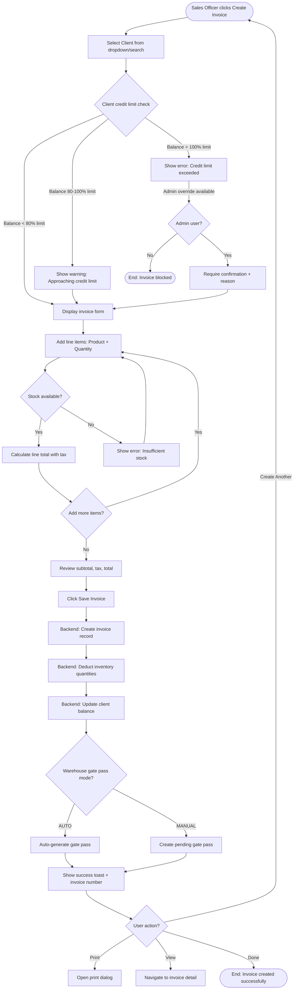

```mermaid
graph TD
    Start([Recovery Agent at client location]) --> OpenApp[Open app on mobile]
    OpenApp --> QuickPay[Tap Record Payment quick action]

    QuickPay --> SelectClient[Search/select client]
    SelectClient --> ShowBalance[Display client current balance]
    ShowBalance --> EnterAmount[Enter payment amount]

    EnterAmount --> ValidateAmount{Amount > 0 and valid?}

    ValidateAmount -->|No| AmountError[Show error: Invalid amount]
    ValidateAmount -->|Yes| SelectMethod[Select payment method]

    AmountError --> EnterAmount
    SelectMethod --> MethodCheck{Method = Cheque or Bank Transfer?}

    MethodCheck -->|Yes| EnterReference[Enter reference number required]
    MethodCheck -->|No Cash| EnterReference[Reference optional]

    EnterReference --> AllocateInvoices{Allocate to invoices?}

    AllocateInvoices -->|Yes| ShowInvoices[Show outstanding invoices list]
    AllocateInvoices -->|No| AddNotes[Add payment notes optional]

    ShowInvoices --> SelectInvoice[Select invoice to pay]
    SelectInvoice --> AllocateAmount[Enter amount to apply to invoice]
    AllocateAmount --> MoreInvoices{Allocate to more invoices?}

    MoreInvoices -->|Yes| ShowInvoices
    MoreInvoices -->|No| AddNotes

    AddNotes --> ReviewPayment[Review payment summary]
    ReviewPayment --> SavePayment[Tap Save Payment]

    SavePayment --> CheckConnection{Internet connected?}

    CheckConnection -->|No| SaveLocal[Save to local storage queue]
    CheckConnection -->|Yes| SubmitServer[Submit to server]

    SaveLocal --> ShowPending[Show pending sync indicator]
    ShowPending --> AutoSync[Auto-sync when connection restored]
    AutoSync --> SubmitServer

    SubmitServer --> CreatePayment[Backend: Create payment record]
    CreatePayment --> UpdateBalance[Backend: Reduce client balance]
    UpdateBalance --> UpdateInvoices[Backend: Mark invoices as paid/partial]
    UpdateInvoices --> ShowSuccess[Show success: Payment recorded]

    ShowSuccess --> Actions{Next action?}
    Actions -->|Print Receipt| GenerateReceipt[Generate PDF receipt]
    Actions -->|Next Client| Start
    Actions -->|Done| EndSuccess([End: Payment recorded successfully])
```

# User Flows

**Part of:** [Design System](./design-system.md)
**Version:** 1.0
**Last Updated:** January 15, 2025

---

## Overview

This document contains detailed workflow diagrams for the 5 most critical business processes in the Hisham Traders ERP system. Each flow includes Mermaid diagrams, edge cases, and error handling strategies.

---

## Flow 1: Create Sales Invoice (Credit Sale)

**User:** Sales Officer
**Goal:** Create an invoice for a client purchasing multiple products on credit
**Frequency:** 20-50 times per day
**Priority:** Critical (revenue-generating)

### Entry Points
- Dashboard "Create Invoice" quick action button
- Sales > Invoices > "+ New Invoice" button
- Client detail page > "Create Invoice" button

### Success Criteria
- Invoice created with accurate product quantities, prices, and tax calculations
- Inventory automatically decremented
- Client balance updated
- Credit limit respected (warning shown if approaching/exceeding)
- Gate pass generated if warehouse configured for auto-generation

### Flow Diagram

### Edge Cases & Error Handling

| Scenario | System Behavior | User Action Required |
|----------|----------------|---------------------|
| **Client has overdue invoices** | Display warning badge "⚠ Client has 3 overdue invoices (45 days old)" | Allow invoice creation (warning only) |
| **Product discontinued/inactive** | Prevent selection, show only active products in search | User must select active product |
| **Partial stock availability** | Show available quantity in error message: "Requested: 100, Available: 75" | User adjusts quantity to available amount |
| **Network failure during save** | Auto-save draft invoice to localStorage, retry on reconnection | User sees "Saving offline..." then "Synced" when online |
| **Batch/lot selection** | If product has multiple batches, show batch picker modal with expiry dates and quantities | User selects batch |
| **Tax-exempt client** | Auto-set tax rate to 0%, show "Tax Exempt" label on invoice | No action needed |
| **Decimal quantity products** | Validate quantity format (2.5 meters allowed, 2.3 boxes not allowed based on unit type) | User enters valid decimal or whole number |

### Performance Notes
- Form auto-saves draft every 30 seconds to localStorage (crash recovery)
- Product search debounced 300ms (reduces API calls)
- Line total calculates on blur (prevents lag during typing)
- Maximum 50 line items per invoice (performance limit)

---

## Flow 2: Record Client Payment (Recovery Agent Mobile)

**User:** Recovery Agent
**Goal:** Visit client, collect payment, record it immediately on mobile phone
**Frequency:** 10-15 times per day
**Priority:** Critical (cash collection)

### Entry Points
- Dashboard "Today's Schedule" > click client name > "Record Payment" button
- Quick action button: "Record Payment" (bottom nav)
- Client detail page > "Record Payment" button

### Success Criteria
- Payment recorded with amount, method, reference
- Client balance reduced
- Payment linked to outstanding invoices (optional)
- Works offline (critical for field use)

### Flow Diagram

### Edge Cases & Error Handling

| Scenario | System Behavior | User Action Required |
|----------|----------------|---------------------|
| **Overpayment** | Allow, creates credit balance, show warning "Overpayment of Rs. 500 will be credited to account" | User confirms intentional overpayment |
| **Partial payment** | Allow, user allocates to specific invoices or applies as account credit | User allocates amount across invoices |
| **No internet connection** | Save to local queue with timestamp, show "Pending Sync (1)" badge | Wait for connection, or continue to next client |
| **Duplicate payment** | Backend checks for duplicate (same client, amount, within 5 min), prevents duplicate | User sees error if duplicate detected |
| **Cheque bounce (post-recording)** | Accountant creates reversal payment to restore balance | Separate reversal workflow |
| **Post-dated cheque** | Record payment with future clearance date, don't reduce balance until date reached | User enters clearance date |
| **Multiple payment methods** | Allow adding multiple payment method rows (part cash, part cheque) | User adds additional payment method row |

### Offline Capability
- **IndexedDB** stores pending payments with timestamp
- **Service Worker** syncs queue when online
- **UI Indicator:** "Pending Sync (3)" badge on dashboard
- **Retry Logic:** Auto-retry failed syncs every 30 seconds
- **Conflict Resolution:** Server timestamp wins (prevents double-payment)

---

## Flow 3: Receive Goods from Purchase Order

**User:** Warehouse Manager
**Goal:** Receive shipment, update inventory, assign bin locations

[Full flow diagram and details - similar structure to above]

---

## Flow 4: Approve Gate Pass (Manual Mode)

**User:** Warehouse Manager
**Goal:** Review and approve pending gate pass for outbound shipment

[Full flow diagram and details]

---

## Flow 5: Check Stock Availability (Mobile)

**User:** Warehouse Manager / Sales Officer
**Goal:** Quickly find product location and quantity while in warehouse or on sales call

[Full flow diagram and details]

---

## Related Documents

- [← Back to Design System Index](./design-system.md)
- [← Previous: Information Architecture](./information-architecture.md)
- [Next: Wireframes →](./wireframes.md)
